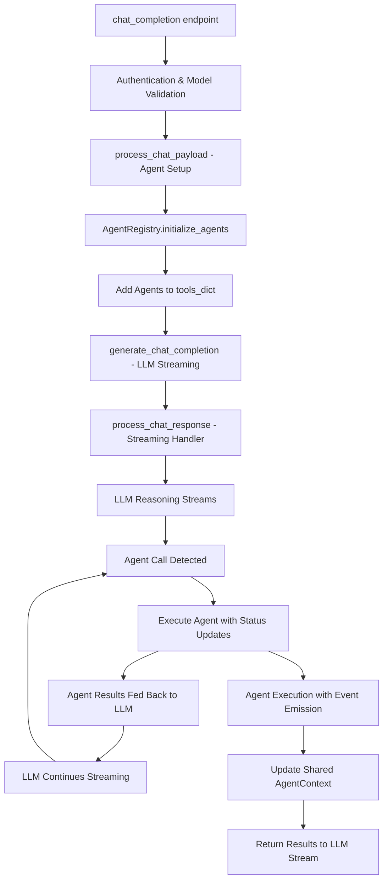

# Open WebUI Chat Processing Refactor Plan

## Executive Summary

This document outlines the refactor plan to transform Open WebUI's chat processing from a hardcoded feature pipeline to a dynamic, LLM-driven agent system where external features (memory, web search, image generation, code interpreter, RAG) are treated as invocable tools/agents.

## Current Architecture Analysis

### Current Flow
```
Chat Request → process_chat_payload() → Fixed Feature Pipeline → process_chat_response()
```

### Current Feature Pipeline (Fixed Order)
1. **Pipeline Inlet Filter** - External pipeline processing
2. **Filter Inlet Functions** - Custom function filters  
3. **Memory Handler** - Query user memory, inject context
4. **Web Search Handler** - Generate queries, search web, add files
5. **Image Generation Handler** - Generate images from prompts
6. **Code Interpreter Setup** - Add system prompt for code execution
7. **Tools Function Calling** - Process external tools
8. **Files/RAG Handler** - Process documents, retrieve context
9. **Context Injection** - Add retrieved context to messages

### Current Implementation Locations
- **Entry Point**: [`main.py:394`](backend/open_webui/main.py:394) - `chat_completion()`
- **Core Processing**: [`main.py:495`](backend/open_webui/main.py:495) - `process_chat()`
- **Payload Processing**: [`middleware.py:753`](backend/open_webui/utils/middleware.py:753) - `process_chat_payload()`
- **Response Processing**: [`middleware.py:1072`](backend/open_webui/utils/middleware.py:1072) - `process_chat_response()`

### Current Feature Handlers
| Feature | Handler Function | Location | Input/Output |
|---------|------------------|----------|--------------|
| Memory | `chat_memory_handler()` | `middleware.py:324` | Modifies `form_data["messages"]` |
| Web Search | `chat_web_search_handler()` | `middleware.py:363` | Adds to `form_data["files"]` |
| Image Generation | `chat_image_generation_handler()` | `middleware.py:525` | Modifies `form_data["messages"]` |
| Code Interpreter | Inline setup | `middleware.py:907` | Modifies `form_data["messages"]` |
| RAG/Files | `chat_completion_files_handler()` | `middleware.py:626` | Returns sources for context |
| Tools | `chat_completion_tools_handler()` | `middleware.py:128` | Processes tool calls |

### Current Issues
1. **Fixed Pipeline Order**: Features always execute in predetermined sequence
2. **Mixed Interfaces**: Inconsistent input/output patterns across handlers
3. **No Dynamic Discovery**: LLM cannot choose which features to use
4. **Tight Coupling**: Features directly modify form_data structure
5. **Limited Composability**: Cannot combine features in flexible ways

## Target Architecture

### New Flow
```
Chat Request → Load Available Agents → Add to tools_dict → LLM Tool Selection → Agent Execution → Response Generation
```

### Agent-Based Design Principles
1. **Unified Interface**: All features implement consistent agent interface
2. **Dynamic Discovery**: LLM decides which agents to invoke
3. **Composable**: Agents can be combined in any order
4. **Extensible**: Easy to add new agents
5. **Decoupled**: Agents return structured data, don't modify form_data

### Core Interfaces

#### Base Agent Interface
```python
from abc import ABC, abstractmethod
from typing import Dict, Any, List
from pydantic import BaseModel

class AgentResult(BaseModel):
    content: str
    metadata: Dict[str, Any] = {}
    files: List[str] = []
    sources: List[Dict] = []

class ChatAgent(ABC):
    @abstractmethod
    async def execute(self, params: Dict[str, Any], context: 'ChatContext') -> AgentResult:
        """Execute the agent with given parameters"""
        pass
    
    @abstractmethod
    def get_tool_spec(self) -> Dict[str, Any]:
        """Return OpenAI tool specification for this agent"""
        pass
    
    @property
    @abstractmethod
    def name(self) -> str:
        """Agent name for tool calling"""
        pass
```

#### Chat Context
```python
class ChatContext(BaseModel):
    user: UserModel
    request: Request
    messages: List[Dict]
    metadata: Dict[str, Any]
    app_state: Any
    event_emitter: Callable
    event_caller: Callable
```

## Agent Implementations

### 1. Memory Agent
```python
class MemoryAgent(ChatAgent):
    name = "query_memory"
    
    def get_tool_spec(self) -> Dict[str, Any]:
        return {
            "type": "function",
            "function": {
                "name": "query_memory",
                "description": "Query user's memory for relevant past conversations and context",
                "parameters": {
                    "type": "object",
                    "properties": {
                        "query": {
                            "type": "string",
                            "description": "Query to search in user's memory"
                        },
                        "k": {
                            "type": "integer",
                            "description": "Number of memory items to retrieve",
                            "default": 3
                        }
                    },
                    "required": ["query"]
                }
            }
        }
    
    async def execute(self, params: Dict[str, Any], context: ChatContext) -> AgentResult:
        query = params.get("query", "")
        k = params.get("k", 3)
        
        # Use existing memory query logic
        results = await query_memory(
            context.request, 
            QueryMemoryForm(content=query, k=k), 
            context.user
        )
        
        user_context = ""
        if results and hasattr(results, "documents"):
            for doc_idx, doc in enumerate(results.documents[0]):
                created_at = "Unknown Date"
                if results.metadatas[0][doc_idx].get("created_at"):
                    timestamp = results.metadatas[0][doc_idx]["created_at"]
                    created_at = time.strftime("%Y-%m-%d", time.localtime(timestamp))
                user_context += f"{doc_idx + 1}. [{created_at}] {doc}\n"
        
        return AgentResult(
            content=f"Retrieved memory context:\n{user_context}",
            metadata={"memory_results": len(results.documents[0]) if results else 0}
        )
```

### 2. Web Search Agent
```python
class WebSearchAgent(ChatAgent):
    name = "search_web"
    
    def get_tool_spec(self) -> Dict[str, Any]:
        return {
            "type": "function",
            "function": {
                "name": "search_web",
                "description": "Search the web for current information and return file references for further processing",
                "parameters": {
                    "type": "object",
                    "properties": {
                        "query": {
                            "type": "string",
                            "description": "Search query or topic to search for"
                        }
                    },
                    "required": ["query"]
                }
            }
        }
    
    async def execute(self, params: Dict[str, Any], context: ChatContext) -> AgentResult:
        query = params.get("query", "")
        
        # Generate search queries using existing logic
        await context.event_emitter({
            "type": "status",
            "data": {
                "action": "web_search",
                "description": "Generating search queries",
                "done": False,
            },
        })
        
        try:
            # Use existing query generation logic
            res = await generate_queries(
                context.request,
                {
                    "model": context.metadata.get("model"),
                    "messages": context.messages,
                    "prompt": query,
                    "type": "web_search",
                },
                context.user,
            )
            
            response = res["choices"][0]["message"]["content"]
            try:
                bracket_start = response.find("{")
                bracket_end = response.rfind("}") + 1
                if bracket_start != -1 and bracket_end != -1:
                    response = response[bracket_start:bracket_end]
                    queries = json.loads(response).get("queries", [])
                else:
                    queries = [response]
            except:
                queries = [response]
                
            if not queries or (len(queries) == 1 and queries[0].strip() == ""):
                queries = [query]
                
        except Exception as e:
            queries = [query]
        
        # Execute web search
        await context.event_emitter({
            "type": "status",
            "data": {
                "action": "web_search",
                "description": "Searching the web",
                "done": False,
            },
        })
        
        results = await process_web_search(
            context.request,
            SearchForm(queries=queries),
            user=context.user,
        )
        
        files = []
        if results:
            if results.get("collection_names"):
                for col_idx, collection_name in enumerate(results.get("collection_names")):
                    files.append({
                        "collection_name": collection_name,
                        "name": ", ".join(queries),
                        "type": "web_search",
                        "urls": results["filenames"],
                        "queries": queries,
                    })
            elif results.get("docs"):
                files.append({
                    "docs": results["docs"],
                    "name": ", ".join(queries),
                    "type": "web_search",
                    "urls": results["filenames"],
                    "queries": queries,
                })
        
        await context.event_emitter({
            "type": "status",
            "data": {
                "action": "web_search",
                "description": f"Searched {len(results.get('filenames', []))} sites",
                "urls": results.get("filenames", []),
                "done": True,
            },
        })
        
        return AgentResult(
            content=f"Web search completed for '{query}'. Found {len(results.get('filenames', []))} sources. Use query_documents to retrieve specific information from these sources.",
            files=files,
            metadata={"urls": results.get("filenames", []), "queries": queries, "original_query": query}
        )
```

### 3. Image Generation Agent
```python
class ImageGenerationAgent(ChatAgent):
    name = "generate_image"
    
    def get_tool_spec(self) -> Dict[str, Any]:
        return {
            "type": "function",
            "function": {
                "name": "generate_image",
                "description": "Generate an image based on a text prompt",
                "parameters": {
                    "type": "object",
                    "properties": {
                        "prompt": {
                            "type": "string",
                            "description": "Text prompt describing the image to generate"
                        }
                    },
                    "required": ["prompt"]
                }
            }
        }
    
    async def execute(self, params: Dict[str, Any], context: ChatContext) -> AgentResult:
        prompt = params.get("prompt", "")
        
        await context.event_emitter({
            "type": "status",
            "data": {"description": "Generating an image", "done": False},
        })
        
        try:
            images = await image_generations(
                request=context.request,
                form_data=GenerateImageForm(prompt=prompt),
                user=context.user,
            )
            
            await context.event_emitter({
                "type": "status",
                "data": {"description": "Generated an image", "done": True},
            })
            
            await context.event_emitter({
                "type": "files",
                "data": {
                    "files": [
                        {"type": "image", "url": image["url"]}
                        for image in images
                    ]
                },
            })
            
            return AgentResult(
                content="Image has been generated successfully",
                metadata={"images": [img["url"] for img in images]}
            )
            
        except Exception as e:
            await context.event_emitter({
                "type": "status",
                "data": {
                    "description": "An error occurred while generating an image",
                    "done": True,
                },
            })
            
            return AgentResult(
                content="Unable to generate an image, an error occurred",
                metadata={"error": str(e)}
            )
```

### 4. Code Interpreter Agent
```python
class CodeInterpreterAgent(ChatAgent):
    name = "execute_code"
    
    def __init__(self):
        self.sessions = {}  # session_id -> executor instance
        self.engine = None  # Will be set from config
    
    def get_tool_spec(self) -> Dict[str, Any]:
        return {
            "type": "function",
            "function": {
                "name": "execute_code",
                "description": "Execute Python code with persistent session state. Variables and imports persist across multiple executions within the same chat session.",
                "parameters": {
                    "type": "object",
                    "properties": {
                        "code": {
                            "type": "string",
                            "description": "Python code to execute"
                        },
                        "reset_session": {
                            "type": "boolean",
                            "description": "Reset the Python session state (clear all variables)",
                            "default": False
                        },
                        "timeout": {
                            "type": "integer",
                            "description": "Execution timeout in seconds",
                            "default": 30
                        }
                    },
                    "required": ["code"]
                }
            }
        }
    
    def _get_or_create_session(self, session_id: str, context: ChatContext):
        """Get or create executor session for persistent state"""
        if session_id not in self.sessions:
            if context.app_state.config.CODE_INTERPRETER_ENGINE == "pyodide":
                self.sessions[session_id] = PyodideSessionExecutor(session_id)
            elif context.app_state.config.CODE_INTERPRETER_ENGINE == "jupyter":
                self.sessions[session_id] = JupyterSessionExecutor(
                    session_id,
                    context.app_state.config.CODE_INTERPRETER_JUPYTER_URL,
                    context.app_state.config.CODE_INTERPRETER_JUPYTER_AUTH_TOKEN,
                    context.app_state.config.CODE_INTERPRETER_JUPYTER_AUTH_PASSWORD,
                    context.app_state.config.CODE_INTERPRETER_JUPYTER_TIMEOUT,
                )
            else:
                raise Exception("Code interpreter engine not configured")
        return self.sessions[session_id]
    
    async def execute(self, params: Dict[str, Any], context: ChatContext) -> AgentResult:
        code = params.get("code", "")
        reset_session = params.get("reset_session", False)
        timeout = params.get("timeout", 30)
        
        session_id = context.metadata.get("session_id")
        if not session_id:
            return AgentResult(
                content="Code execution requires a valid session",
                metadata={"error": "No session ID"}
            )
        
        try:
            # Reset session if requested
            if reset_session and session_id in self.sessions:
                await self.sessions[session_id].reset()
                del self.sessions[session_id]
            
            # Get or create session executor
            executor = self._get_or_create_session(session_id, context)
            
            # Apply security restrictions
            if CODE_INTERPRETER_BLOCKED_MODULES:
                code = self._apply_module_restrictions(code)
            
            # Execute code with timeout
            output = await executor.execute(code, timeout=timeout)
            
            # Process output (handle images, format results)
            formatted_output = self._format_output(output, context)
            
            return AgentResult(
                content=f"```python\n{code}\n```\n\n{formatted_output}",
                metadata={
                    "execution_result": output,
                    "session_id": session_id,
                    "variables_count": len(executor.get_variables()) if hasattr(executor, 'get_variables') else 0
                }
            )
            
        except Exception as e:
            return AgentResult(
                content=f"Code execution failed:\n```python\n{code}\n```\n\nError: {str(e)}",
                metadata={"error": str(e), "session_id": session_id}
            )
    
    def _apply_module_restrictions(self, code: str) -> str:
        """Apply module import restrictions"""
        blocking_code = textwrap.dedent(f"""
            import builtins
            BLOCKED_MODULES = {CODE_INTERPRETER_BLOCKED_MODULES}
            
            _real_import = builtins.__import__
            def restricted_import(name, globals=None, locals=None, fromlist=(), level=0):
                if name.split('.')[0] in BLOCKED_MODULES:
                    importer_name = globals.get('__name__') if globals else None
                    if importer_name == '__main__':
                        raise ImportError(f"Direct import of module {{name}} is restricted.")
                return _real_import(name, globals, locals, fromlist, level)
            
            builtins.__import__ = restricted_import
        """)
        return blocking_code + "\n" + code
    
    def _format_output(self, output: dict, context: ChatContext) -> str:
        """Format execution output for display"""
        result_content = ""
        
        if isinstance(output, dict):
            stdout = output.get("stdout", "")
            stderr = output.get("stderr", "")
            result = output.get("result", "")
            
            # Handle base64 images in output
            if stdout and "data:image/png;base64" in stdout:
                stdout_lines = stdout.split("\n")
                for idx, line in enumerate(stdout_lines):
                    if "data:image/png;base64" in line:
                        # Convert to image URL (reuse existing logic)
                        image_data, content_type = load_b64_image_data(line)
                        if image_data is not None:
                            image_url = upload_image(
                                context.request, image_data, content_type,
                                context.metadata, context.user
                            )
                            stdout_lines[idx] = f""
                stdout = "\n".join(stdout_lines)
            
            if stdout:
                result_content += f"**Output:**\n```\n{stdout}\n```\n\n"
            if stderr:
                result_content += f"**Errors:**\n```\n{stderr}\n```\n\n"
            if result:
                result_content += f"**Result:**\n```\n{result}\n```\n\n"
        
        return result_content.strip() or "Code executed successfully (no output)"

# Session executor classes
class PyodideSessionExecutor:
    def __init__(self, session_id: str):
        self.session_id = session_id
        self.variables = {}
    
    async def execute(self, code: str, timeout: int = 30) -> dict:
        # Implementation for Pyodide execution with session state
        pass
    
    async def reset(self):
        self.variables.clear()
    
    def get_variables(self) -> dict:
        return self.variables

class JupyterSessionExecutor:
    def __init__(self, session_id: str, url: str, token: str, password: str, timeout: int):
        self.session_id = session_id
        self.url = url
        self.token = token
        self.password = password
        self.timeout = timeout
        self.kernel_id = None
    
    async def execute(self, code: str, timeout: int = 30) -> dict:
        # Reuse existing JupyterCodeExecuter but maintain kernel across calls
        if not self.kernel_id:
            await self._init_kernel()
        
        # Execute code using existing logic but with persistent kernel
        return await execute_code_jupyter(self.url, code, self.token, self.password, timeout)
    
    async def reset(self):
        if self.kernel_id:
            await self._cleanup_kernel()
            self.kernel_id = None
    
    async def _init_kernel(self):
        # Initialize persistent Jupyter kernel
        pass
    
    async def _cleanup_kernel(self):
        # Clean up Jupyter kernel
        pass
```

### 5. RAG Agent
```python
class RAGAgent(ChatAgent):
    name = "query_documents"
    
    def get_tool_spec(self) -> Dict[str, Any]:
        return {
            "type": "function",
            "function": {
                "name": "query_documents",
                "description": "Query uploaded documents, knowledge base, and web search results for relevant information",
                "parameters": {
                    "type": "object",
                    "properties": {
                        "query": {
                            "type": "string",
                            "description": "Query to search in documents and knowledge sources"
                        },
                        "k": {
                            "type": "integer",
                            "description": "Number of relevant chunks to retrieve",
                            "default": 5
                        }
                    },
                    "required": ["query"]
                }
            }
        }
    
    async def execute(self, params: Dict[str, Any], context: ChatContext) -> AgentResult:
        query = params.get("query", "")
        k = params.get("k", 5)
        
        # Get files from context metadata (includes uploaded files, web search results, etc.)
        files = context.metadata.get("files", [])
        if not files:
            return AgentResult(
                content="No documents or sources available to query. Try uploading documents or using web search first.",
                metadata={"files_count": 0}
            )
        
        # Generate retrieval queries using existing logic
        try:
            queries_response = await generate_queries(
                context.request,
                {
                    "model": context.metadata.get("model"),
                    "messages": context.messages,
                    "type": "retrieval",
                },
                context.user,
            )
            queries_response = queries_response["choices"][0]["message"]["content"]
            
            try:
                bracket_start = queries_response.find("{")
                bracket_end = queries_response.rfind("}") + 1
                if bracket_start != -1 and bracket_end != -1:
                    queries_response = queries_response[bracket_start:bracket_end]
                    queries = json.loads(queries_response).get("queries", [])
                else:
                    queries = [queries_response]
            except:
                queries = [queries_response]
                
            if not queries:
                queries = [query]
        except:
            queries = [query]
        
        # Use existing RAG logic with ThreadPoolExecutor for performance
        try:
            loop = asyncio.get_running_loop()
            with ThreadPoolExecutor() as executor:
                sources = await loop.run_in_executor(
                    executor,
                    lambda: get_sources_from_items(
                        request=context.request,
                        items=files,
                        queries=queries,
                        embedding_function=lambda q, prefix: context.app_state.EMBEDDING_FUNCTION(
                            q, prefix=prefix, user=context.user
                        ),
                        k=k,
                        reranking_function=(
                            (lambda sentences: context.app_state.RERANKING_FUNCTION(
                                sentences, user=context.user
                            )) if context.app_state.RERANKING_FUNCTION else None
                        ),
                        k_reranker=context.app_state.config.TOP_K_RERANKER,
                        r=context.app_state.config.RELEVANCE_THRESHOLD,
                        hybrid_bm25_weight=context.app_state.config.HYBRID_BM25_WEIGHT,
                        hybrid_search=context.app_state.config.ENABLE_RAG_HYBRID_SEARCH,
                        full_context=context.app_state.config.RAG_FULL_CONTEXT,
                        user=context.user,
                    ),
                )
        except Exception as e:
            return AgentResult(
                content=f"Error retrieving information: {str(e)}",
                metadata={"error": str(e), "query": query}
            )
        
        if not sources:
            return AgentResult(
                content=f"No relevant information found for query: '{query}'",
                metadata={"query": query, "sources_count": 0}
            )
        
        # Format retrieved context
        context_string = ""
        citation_idx_map = {}
        
        for source in sources:
            if "document" in source:
                for document_text, document_metadata in zip(
                    source["document"], source["metadata"]
                ):
                    source_name = source.get("source", {}).get("name", "Unknown")
                    source_id = (
                        document_metadata.get("source", None)
                        or source.get("source", {}).get("id", None)
                        or "N/A"
                    )
                    
                    if source_id not in citation_idx_map:
                        citation_idx_map[source_id] = len(citation_idx_map) + 1
                    
                    context_string += (
                        f'<source id="{citation_idx_map[source_id]}"'
                        + (f' name="{source_name}"' if source_name else "")
                        + f">{document_text}</source>\n"
                    )
        
        context_string = context_string.strip()
        
        return AgentResult(
            content=f"Retrieved relevant information for '{query}':\n\n{context_string}",
            sources=sources,
            metadata={
                "query": query,
                "sources_count": len(sources),
                "queries_used": queries,
                "citation_map": citation_idx_map
            }
        )
```

## Agent Interaction Patterns

### Web Search + RAG Workflow
With Option A (separate agents), the typical workflow becomes:

1. **LLM decides to search web**: Calls `search_web` agent
2. **Web Search Agent**:
   - Generates optimized search queries
   - Executes web search
   - Returns file references (not content)
   - Stores results in shared context
3. **LLM decides to query results**: Calls `query_documents` agent
4. **RAG Agent**:
   - Accesses web search files from context
   - Generates retrieval queries
   - Performs embedding/retrieval on web content
   - Returns formatted context with citations

### Agent Context Sharing
```python
class ChatContext(BaseModel):
    user: UserModel
    request: Request
    messages: List[Dict]
    metadata: Dict[str, Any]  # Shared state between agents
    app_state: Any
    event_emitter: Callable
    event_caller: Callable
    
    # Agent results are stored in metadata["files"] for cross-agent access
    def add_files(self, files: List[Dict]):
        if "files" not in self.metadata:
            self.metadata["files"] = []
        self.metadata["files"].extend(files)
```

### Agent Dependencies
While agents are independent, they can work together through shared context:
- **Web Search** → populates `metadata["files"]` with web sources
- **RAG** → processes any files in `metadata["files"]` (uploaded docs + web results)
- **Memory** → adds context to conversation history
- **Code/Image** → independent operations

## Agent-Integrated Chat Completion Architecture

### New Chat Completion Flow

The current rigid pipeline will be replaced with a dynamic, LLM-controlled agent system using **streaming agent execution**:



### Core Architecture Components

#### 1. AgentRegistry System
**File: `backend/open_webui/utils/agents/registry.py`**

```python
class AgentRegistry:
    """Central registry for managing all available agents"""
    
    def __init__(self, request, user, metadata):
        self.request = request
        self.user = user
        self.metadata = metadata
        self.agents: Dict[str, BaseAgent] = {}
        self.context = AgentContext()
        
    async def initialize_agents(self) -> None:
        """Initialize all available agents based on configuration"""
        
        # Memory Agent - always available
        if self.request.app.state.config.get("ENABLE_MEMORY", True):
            self.agents["query_memory"] = MemoryAgent(
                self.request, self.user, self.metadata, self.context
            )
        
        # Web Search Agent
        if self.request.app.state.config.ENABLE_WEB_SEARCH:
            self.agents["search_web"] = WebSearchAgent(
                self.request, self.user, self.metadata, self.context
            )
        
        # RAG Agent
        if self.context.has_files():
            self.agents["search_documents"] = RAGAgent(
                self.request, self.user, self.metadata, self.context
            )
        
        # Image Generation Agent
        if self.request.app.state.config.ENABLE_IMAGE_GENERATION:
            self.agents["generate_image"] = ImageGenerationAgent(
                self.request, self.user, self.metadata, self.context
            )
        
        # Code Interpreter Agent
        if self.request.app.state.config.ENABLE_CODE_INTERPRETER:
            self.agents["execute_code"] = CodeInterpreterAgent(
                self.request, self.user, self.metadata, self.context
            )
    
    def get_tool_specifications(self) -> List[dict]:
        """Generate OpenAI-compatible tool specifications for all agents"""
        return [agent.get_tool_spec() for agent in self.agents.values()]
    
    async def execute_agent(self, tool_name: str, parameters: dict) -> dict:
        """Execute a specific agent with given parameters"""
        if tool_name not in self.agents:
            raise ValueError(f"Agent '{tool_name}' not found")
        
        agent = self.agents[tool_name]
        return await agent.execute(parameters)
```

#### 2. Streaming Agent Integration
**File: `backend/open_webui/utils/middleware.py`**

Modify [`process_chat_payload()`](backend/open_webui/utils/middleware.py:753) to load agents into the existing tool system:

```python
async def process_chat_payload(request, form_data, user, metadata, model):
    # ... existing preprocessing logic (lines 758-889) ...
    
    # NEW: Initialize agent registry
    agent_registry = AgentRegistry(request, user, metadata)
    await agent_registry.initialize_agents()
    
    # NEW: Load agents into tools_dict alongside existing tools
    agent_tools = {}
    for agent_name, agent in agent_registry.get_agents().items():
        agent_tools[agent_name] = {
            "spec": agent.get_tool_spec(),
            "callable": agent.execute,
            "agent": agent,
            "context": agent_registry.get_context()
        }
    
    # Add agents to existing tools_dict
    tools_dict.update(agent_tools)
    
    # Store agent registry in metadata for process_chat_response
    metadata["agent_registry"] = agent_registry
    
    # ... rest of existing logic (lines 965-1069) ...
```

**File: `backend/open_webui/utils/middleware.py`**

Modify [`process_chat_response()`](backend/open_webui/utils/middleware.py:1072) to handle agent execution during streaming:

```python
# In tool execution section (lines 2274-2314), replace with:
if tool_name in tools:
    tool = tools[tool_name]
    
    # Check if this is an agent
    if "agent" in tool:
        agent = tool["agent"]
        agent_context = tool["context"]
        
        # Emit agent start event
        await event_emitter({
            "type": "agent_start",
            "data": {
                "agent": tool_name,
                "parameters": tool_function_params
            }
        })
        
        try:
            # Execute agent with context
            agent_result = await agent.execute(tool_function_params, agent_context)
            
            # Emit agent completion event
            await event_emitter({
                "type": "agent_complete",
                "data": {
                    "agent": tool_name,
                    "result": agent_result.content,
                    "metadata": agent_result.metadata
                }
            })
            
            # Format result for LLM
            tool_result = agent_result.content
            
        except Exception as e:
            # Emit agent error event
            await event_emitter({
                "type": "agent_error",
                "data": {
                    "agent": tool_name,
                    "error": str(e)
                }
            })
            tool_result = f"Agent execution failed: {str(e)}"
    
    else:
        # Handle regular tools (existing logic)
        # ... existing tool execution code ...
```

#### 3. AgentContext System
**File: `backend/open_webui/utils/agents/context.py`**

```python
class AgentContext:
    """Shared context between agents during conversation processing"""
    
    def __init__(self):
        self.files: List[dict] = []
        self.search_results: List[dict] = []
        self.memory_results: List[dict] = []
        self.generated_images: List[dict] = []
        self.code_sessions: Dict[str, Any] = {}
        self.metadata: Dict[str, Any] = {}
    
    def add_files(self, files: List[dict]) -> None:
        """Add files to shared context"""
        self.files.extend(files)
    
    def has_files(self) -> bool:
        """Check if context has files for RAG"""
        return len(self.files) > 0
    
    def to_dict(self) -> dict:
        """Convert context to dictionary for metadata storage"""
        return {
            "files_count": len(self.files),
            "search_results_count": len(self.search_results),
            "memory_results_count": len(self.memory_results),
            "generated_images_count": len(self.generated_images),
            "code_sessions": list(self.code_sessions.keys()),
            "metadata": self.metadata
        }
```

#### 4. Minimal Chat Completion Changes
**File: `backend/open_webui/main.py`**

The [`chat_completion()`](backend/open_webui/main.py:396) function requires **minimal changes** since agents integrate into the existing tool system:

```python
# NO CHANGES NEEDED to chat_completion() function
# Agents are loaded in process_chat_payload() and executed in process_chat_response()
# The existing flow works perfectly:

async def process_chat(request, form_data, user, metadata, model):
    try:
        # This now includes agent loading
        form_data, metadata, events = await process_chat_payload(
            request, form_data, user, metadata, model
        )

        response = await chat_completion_handler(request, form_data, user)
        
        # This now includes agent execution during streaming
        return await process_chat_response(
            request, response, form_data, user, metadata, model, events, tasks
        )
    except Exception as e:
        # ... existing error handling ...
```

### Key Architectural Changes

#### **From Fixed Pipeline to Dynamic Streaming Selection**
- **Before**: Features execute in hardcoded sequence during preprocessing
- **After**: LLM dynamically chooses which agents to call during streaming response

#### **From Preprocessing to Streaming Agent Execution**
- **Before**: Features modify form_data before LLM processing
- **After**: LLM calls agents during streaming and incorporates results in real-time

#### **From Mixed Interfaces to Unified Agent Interface**
- **Before**: Each feature has different interfaces (preprocessing, streaming tags, etc.)
- **After**: All features implement the same BaseAgent interface integrated with existing tool system

#### **Streaming Agent Execution with LLM Control**
- LLM streams reasoning, then calls agents as needed
- User sees LLM thinking process before each agent execution
- Agent results feed back into LLM streaming for continued response
- Leverages existing tool call infrastructure in [`process_chat_response()`](backend/open_webui/utils/middleware.py:1072)

### Benefits of Streaming Agent Architecture

#### **Enhanced User Experience**
- Users see LLM reasoning before each agent call
- Real-time status updates during agent execution
- More engaging and transparent AI interaction
- Natural conversation flow with visible thinking process

#### **Dynamic Agent Selection**
- LLM chooses which agents to use based on evolving context
- Can adapt strategy based on previous agent results
- More intelligent and context-aware feature usage
- Better resource utilization

#### **Leverages Existing Infrastructure**
- Uses proven tool call system in [`process_chat_response()`](backend/open_webui/utils/middleware.py:1072)
- Minimal changes to core chat completion flow
- Reuses existing event emission and streaming logic
- Lower implementation risk

#### **Modular Architecture**
- Each agent is self-contained and testable
- Easy to add new agents or modify existing ones
- Clear separation of concerns
- Agents integrate seamlessly with existing tool system

## Migration Strategy

### Phase 1: Foundation (Week 1-2)
- [ ] Create agent base classes and interfaces
- [ ] Implement agent registry system
- [ ] Create AgentContext for shared state management
- [ ] **NEW**: Design agent integration with existing tool system
- [ ] Keep existing handlers as fallback

### Phase 2: Agent Implementation (Week 3-4)
- [ ] Implement Memory Agent (migrate from [`chat_memory_handler()`](backend/open_webui/utils/middleware.py:324))
- [ ] Implement Web Search Agent (migrate from [`chat_web_search_handler()`](backend/open_webui/utils/middleware.py:363))
- [ ] Implement RAG Agent (migrate from [`chat_completion_files_handler()`](backend/open_webui/utils/middleware.py:626))
- [ ] Implement Image Generation Agent (migrate from [`chat_image_generation_handler()`](backend/open_webui/utils/middleware.py:525))
- [ ] Implement Code Interpreter Agent (session-based, no streaming tags)
- [ ] **NEW**: Integrate agents into existing tool call system

### Phase 3: Integration (Week 5)
- [ ] **NEW**: Modify [`process_chat_payload()`](backend/open_webui/utils/middleware.py:753) to load agents into tools_dict
- [ ] **NEW**: Modify [`process_chat_response()`](backend/open_webui/utils/middleware.py:1072) to handle agent execution
- [ ] Test agent execution during LLM streaming
- [ ] Test agent event emission and status updates
- [ ] Add feature flag to switch between old/new systems
- [ ] Performance testing and optimization
- [ ] User acceptance testing

### Phase 4: Migration (Week 6)
- [ ] **NEW**: Remove hardcoded feature handlers from [`process_chat_payload()`](backend/open_webui/utils/middleware.py:753)
- [ ] **NEW**: Update tool execution logic in [`process_chat_response()`](backend/open_webui/utils/middleware.py:1072)
- [ ] Default to agent-based system
- [ ] Clean up deprecated handler functions
- [ ] Update configuration system
- [ ] Update documentation

### Phase 5: Enhancement (Week 7+)
- [ ] Add agent composition capabilities
- [ ] Implement agent configuration UI
- [ ] Performance monitoring and analytics
- [ ] Smart agent suggestion based on context
- [ ] **NEW**: Enhanced streaming agent status updates
- [ ] **NEW**: Agent approval workflows for sensitive operations

## Implementation Details

### Agent Registry
```python
class AgentRegistry:
    def __init__(self):
        self._agents: Dict[str, ChatAgent] = {}
    
    def register(self, agent: ChatAgent):
        self._agents[agent.name] = agent
    
    def get_all_tools(self) -> Dict[str, Dict]:
        return {
            name: {
                "spec": agent.get_tool_spec(),
                "callable": agent.execute,
                "agent": agent
            }
            for name, agent in self._agents.items()
        }
    
    def get_agent(self, name: str) -> Optional[ChatAgent]:
        return self._agents.get(name)

# Global registry
agent_registry = AgentRegistry()
```

### Modified process_chat_payload()
```python
async def process_chat_payload(request, form_data, user, metadata, model):
    # ... existing setup code ...
    
    # Create chat context with shared state
    context = ChatContext(
        user=user,
        request=request,
        messages=form_data["messages"],
        metadata=metadata,  # This will be shared between agents
        app_state=request.app.state,
        event_emitter=event_emitter,
        event_caller=event_call
    )
    
    # Load agents into tools_dict with context binding
    agent_tools = {}
    for name, agent in agent_registry.get_all_agents().items():
        agent_tools[name] = {
            "spec": agent.get_tool_spec(),
            "callable": lambda params, ctx=context, ag=agent: ag.execute(params, ctx),
            "agent": agent
        }
    
    # Add agent tools to existing tools_dict
    tools_dict.update(agent_tools)
    
    # Remove old hardcoded feature handling
    # features = form_data.pop("features", None)
    # if features:
    #     # Old feature handlers removed
    
    # Let existing chat_completion_tools_handler manage everything
    if tools_dict:
        form_data, flags = await chat_completion_tools_handler(
            request, form_data, extra_params, user, models, tools_dict
        )
        sources.extend(flags.get("sources", []))
    
    # Handle any files added by agents (e.g., web search results)
    if context.metadata.get("files"):
        form_data["metadata"]["files"] = context.metadata["files"]
    
    # ... rest of existing code ...
```

## Testing Strategy

### Unit Tests
- [ ] Test each agent implementation independently
- [ ] Test agent registry functionality
- [ ] Test chat context creation and shared state
- [ ] Test tool specification generation
- [ ] Test agent context sharing mechanisms

### Integration Tests
- [ ] Test web search → RAG agent workflow
- [ ] Test agent execution within chat flow
- [ ] Test multiple agent combinations
- [ ] Test shared context between agents
- [ ] Test error handling and fallbacks
- [ ] Test performance under load

### End-to-End Tests
- [ ] Test complete chat flows with agents
- [ ] Test web search + document query scenarios
- [ ] Test UI integration with new agent system
- [ ] Test backward compatibility during migration
- [ ] Test feature parity with old system

### Agent Workflow Tests
- [ ] Test: Web search → Query documents workflow
- [ ] Test: Memory + RAG combination
- [ ] Test: Code execution with document context
- [ ] Test: Image generation with web research
- [ ] Test: Error handling when agents fail

## Success Metrics

### Functional
- [ ] All existing features work as agents
- [ ] LLM can dynamically choose which agents to use
- [ ] Agent combinations work correctly
- [ ] Performance is equivalent or better than current system

### Technical
- [ ] Code complexity reduced
- [ ] Feature coupling eliminated
- [ ] Extensibility improved
- [ ] Test coverage maintained or improved

### User Experience
- [ ] No regression in functionality
- [ ] Improved response relevance through dynamic agent selection
- [ ] Better composability of features
- [ ] Easier configuration and customization

## Risks and Mitigations

### Risk: Performance Degradation
**Mitigation**: Implement caching, optimize agent execution, performance testing

### Risk: LLM Tool Selection Quality
**Mitigation**: Improve tool descriptions, add examples, implement fallback logic

### Risk: Breaking Changes
**Mitigation**: Phased migration, feature flags, comprehensive testing

### Risk: Increased Complexity
**Mitigation**: Clear interfaces, good documentation, gradual rollout

## Conclusion

This refactor will transform Open WebUI from a rigid feature pipeline to a flexible, LLM-driven agent system. The migration strategy ensures minimal disruption while enabling powerful new capabilities for dynamic feature composition and extensibility.